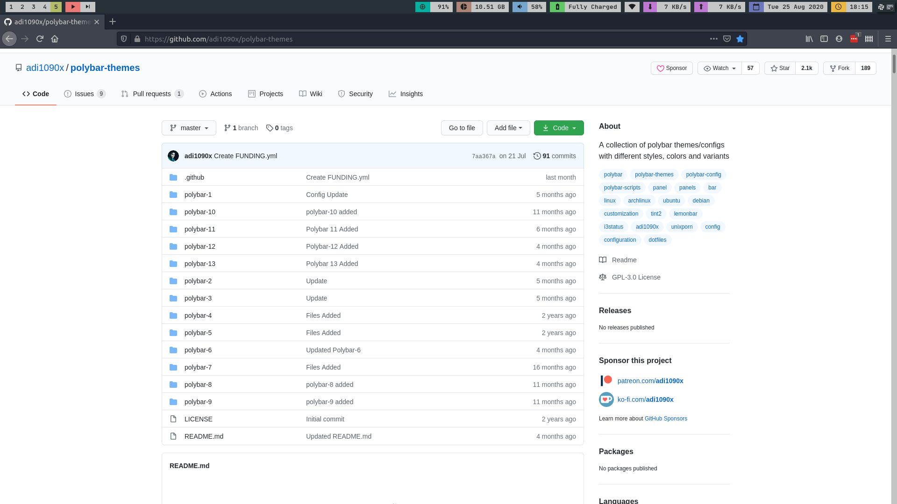

# dotfiles
Configs and so on for my desktop set up

## What's here

The following go in ~/.config

- dunst
- mpDris2
- polybar-01 (as polybar)
- regolith

The _.dotfiles_ go in my home folder. Configuration for

- mpd
- ncmpcpp
- zsh
- Xresources

## Screenshots

### Polybar 01

  

